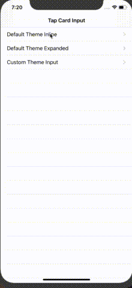
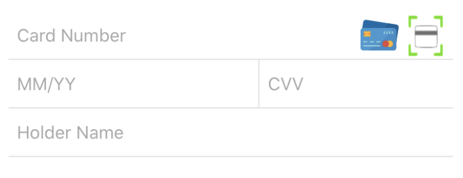
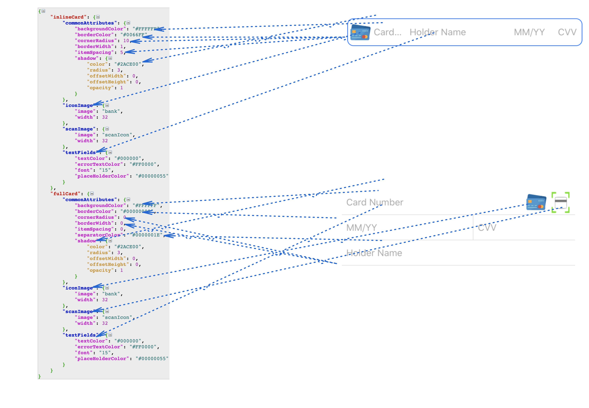

# TapCardInputKit-iOS

A SDK that provides a highly customisable on the shelf view to collect payment card data in your app with different modes.

[](https://github.com/Tap-Payments/TapThemeManger-iOS)
[](https://img.shields.io/Tap-Payments/v/TapCardInputKit-iOS)




## Requirements

To use the SDK the following requirements must be met:

1. **Xcode 11.0** or newer
2. **Swift 4.2** or newer (preinstalled with Xcode)
3. Deployment target SDK for the app: **iOS 12.0** or later


## Installation

------

### Installation with CocoaPods

[CocoaPods](http://cocoapods.org/) is a dependency manager, which automates and simplifies the process of using 3rd-party libraries in your projects.
You can install it with the following command:

```
$ gem install cocoapods
```

### Podfile

To integrate goSellSDK into your Xcode project using CocoaPods, specify it in your `Podfile`:

```
platform :ios, '12.0'
use_frameworks!

source 'https://github.com/CocoaPods/Specs.git'

target 'MyApp' do
    
    pod 'TapCardInputKit-iOS'

end
```

Then, run the following command:

```
$ pod update
```


## Features

------

`TapCardInputKit` provides an easy on the shelf UI component to collect payment card data inside your app.  This comes with many on the side features as:

- Live card brand detection.

- Live card number validation.

- Live card number spacing based on card brand.

- Card CVV validation.

- Inline mode:

  - 

- Full mode:

  - 

  Making it one of the most inclusive pods in the market, yet one of the easiest to integrate with.

## Models

This section will descripe the models used within the kit. This is an important introduction to understand how to utilise and use the kit.


### CardInputMode

This an expressive enum to decide the UI mode you want to show the card collector with inside your app.

*Swift*:

```swift
/// This when you want show one line card input
case InlineCardInput = 0
/// This when you want show full multline card input
case FullCardInput = 1

```


### TapCard

This model represents the Card object that the KIT will return when a user enters any data inside the UIView and to use when your app wants to fill the form with certain data.

*Swift*:

```swift
 /**
     This is the default constructor for creating the TapCard model
     - Parameter tapCardNumber: Represents the card number if any. Otherwise, it will be nil
     - Parameter tapCardName: Represents the card name if any. Otherwise, it will be nil
     - Parameter tapCardExpiryMonth: Represents the card expiration month MM if any. Otherwise, it will be nil
     - Parameter tapCardExpiryYear: Represents the card exxpiration year YYYY or YY if any. Otherwise, it will be nil
     */
    @objc public init(tapCardNumber:String? = nil,tapCardName:String? = nil,tapCardExpiryMonth:String? = nil, tapCardExpiryYear:String? = nil, tapCardCVV:String? = nil)
```


## Controllers

This section descripes the actual controllers that your app will be dealing with. The controller is different based on the integration mode the app utilises.


### TapCardInput

This is the UIView that shows the card collector inside your layout. You can start/config the collector by calling its setup method as follows

*Swift*:

```swift
 /**
     Call this method when you  need to setup the view with a custom theme json file. Setup method is reponsible for laying out the view,  adding subviews and applying the default theme
     - Parameter cardInputMode: Defines the card input mode required whether Inline or Full mode
     */
    @objc public func setup(for cardInputMode:CardInputMode)
```


## Theme Customisation

`TapCardInput-Kit`is highly customisable UI wise.

The kit already provides a default design for both light and dark modes. If you will use the kit with the default theme it will be the KIT's responsibilty to listen to light/dark mode changes, but if you startedthe kit with your own theme then you have to instruct the kit to change theme whenever needed.

Also the KIT allows you passing the theme as Dictionary or JSON file.


### Theme Mapping



### Theme JSON Structure


*JSON*

```json
{
    "inlineCard": {
        "commonAttributes": {
            "backgroundColor": "#FFFFFF", 
            "borderColor": "#0066FF", 
            "cornerRadius": 10, 
            "borderWidth": 1, 
            "itemSpacing": 5, 
            "shadow": {
                "color": "#2ACE00", 
                "radius": 3, 
                "offsetWidth": 0, 
                "offsetHeight": 0, 
                "opacity": 1
            }
        }, 
        "iconImage": {
            "image": "bank", 
            "width": 32
        }, 
        "scanImage": {
            "image": "scanIcon", 
            "width": 32
        }, 
        "textFields": {
            "textColor": "#000000", 
            "errorTextColor": "#FF0000", 
            "font": "15", 
            "placeHolderColor": "#00000055"
        }
    }, 
    "fullCard": {
        "commonAttributes": {
            "backgroundColor": "#FFFFFF", 
            "borderColor": "#00000000", 
            "cornerRadius": 0, 
            "borderWidth": 0, 
            "itemSpacing": 0, 
            "separatorColor": "#0000001E", 
            "shadow": {
                "color": "#2ACE00", 
                "radius": 3, 
                "offsetWidth": 0, 
                "offsetHeight": 0, 
                "opacity": 1
            }
        }, 
        "iconImage": {
            "image": "bank", 
            "width": 32
        }, 
        "scanImage": {
            "image": "scanIcon", 
            "width": 32
        }, 
        "textFields": {
            "textColor": "#000000", 
            "errorTextColor": "#FF0000", 
            "font": "15", 
            "placeHolderColor": "#00000055"
        }
    }
}
```


## Examples

### Show the TapCardInput UIView

*Swift*:

```swift
import TapCardInputKit_iOS
import CommonDataModelsKit_iOS

/// This is an ouutlet from the TapCardInput you created inside your storyboard
@IBOutlet weak var cardInput: TapCardInput!

/// Set the delegate to yourself
cardInput.delegate = self
/// Setup the card input view by stating which mode and if you want to apply a certain theme
cardInput.setup(for: (isInline ? .InlineCardInput : .FullCardInput), withDictionaryTheme: themeDictionaty)
/// PS. You can show the card input with the default view as follows
cardInput.setup(for: (isInline ? .InlineCardInput : .FullCardInput))
```


### Utilizing TapCardInputProtocol Delegate

*Swift*:

```swift
import TapCardInputKit_iOS
import CommonDataModelsKit_iOS

extension ExampleCardInputViewController: TapCardInputProtocol {
   /**
     This method will be called whenever the card data in the form has changed. It is being called in a live manner
     - Parameter tapCard: The TapCard model that hold sthe data the currently enetred by the user till now
     */
    func cardDataChanged(tapCard: TapCard) {
        print("Card Number : \(tapCard.tapCardNumber ?? "")\nCard Name : \(tapCard.tapCardName ?? "")\nCard Expiry : \(tapCard.tapCardExpiryMonth ?? "")/\(tapCard.tapCardExpiryYear ?? "")\nCard CVV : \(tapCard.tapCardCVV ?? "")\n\(resultTextView.text ?? "")\n")
    }
    /// This method will be called once the user clicks on Scan button
    func scanCardClicked() {
        print("SCAN CLICKED\n\(resultTextView.text ?? "")\n");
    }
}
```


### Public attributes and methods in the TapCardInput

*Swift*:

```swift
 /// This defines the mode required to show the card input view in whether Full or Inline
    @objc public var cardInputMode:CardInputMode = .FullCardInput
/// States if the parent controller wants to show a scanning option or not
    @objc public lazy var showScanningOption:Bool = true
/**
     Call this method when you  need to fill in the text fields with data.
     - Parameter tapCard: The TapCard that holds the data needed to be filled into the textfields
     */
    @objc public func setCardData(tapCard:TapCard)
```

